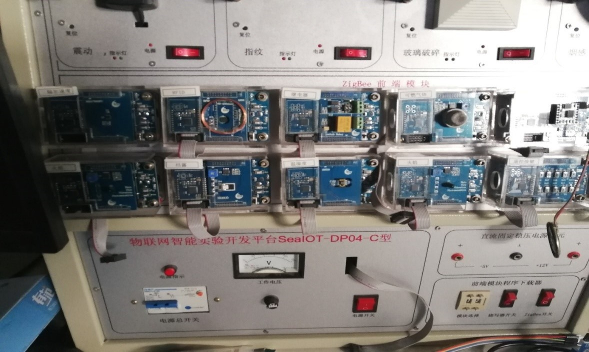
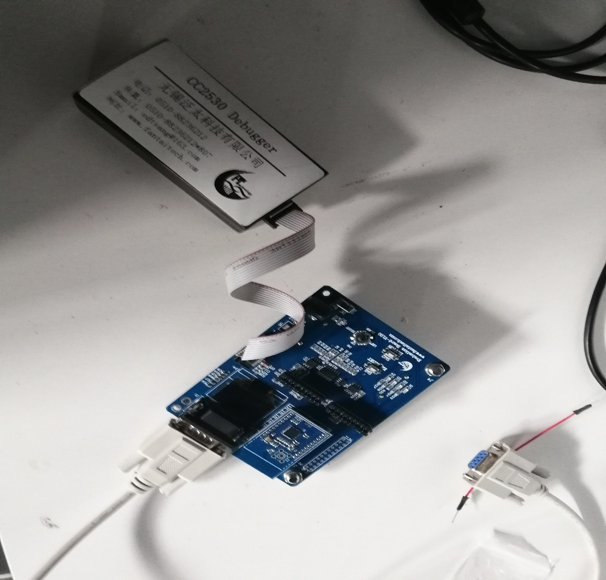
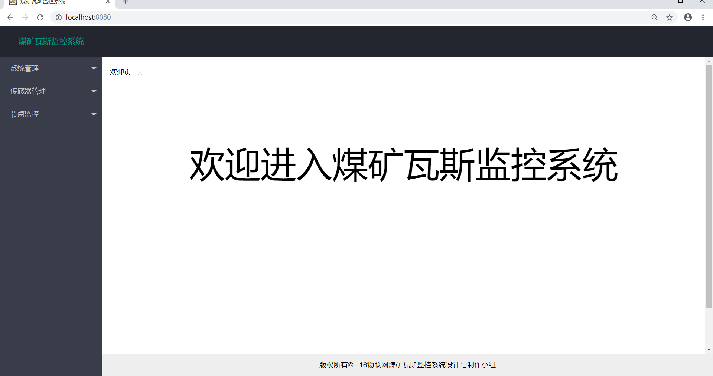
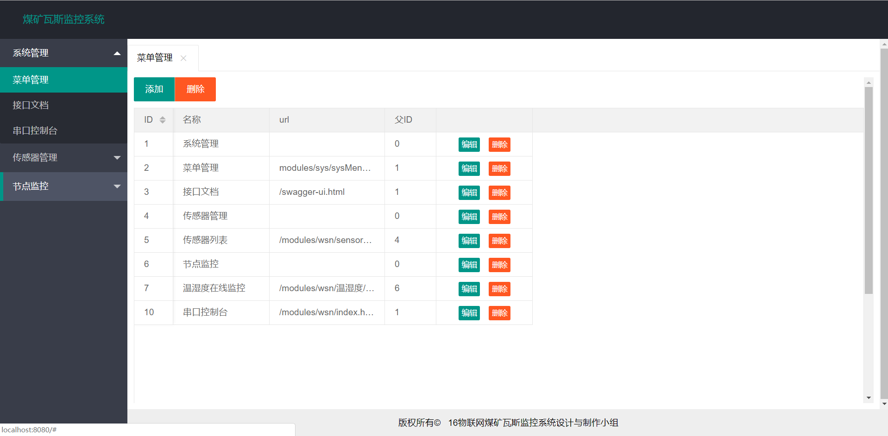
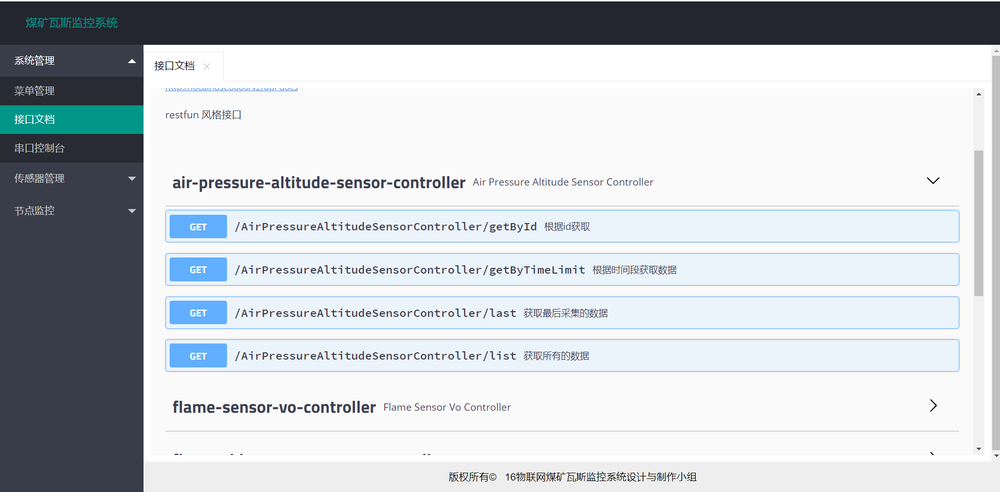
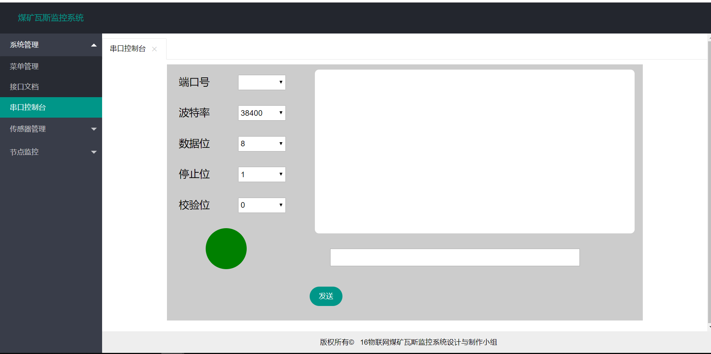
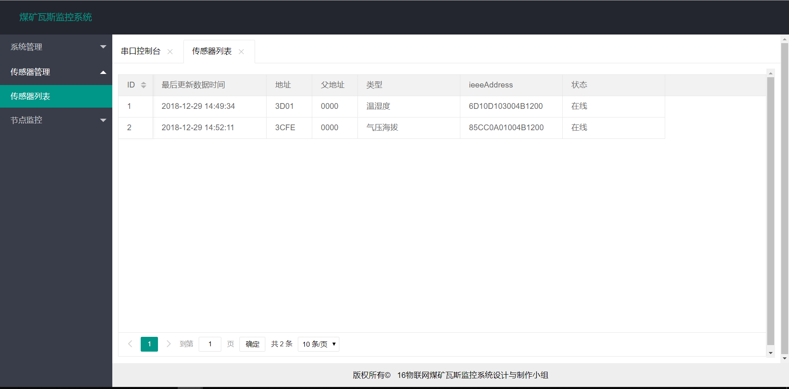
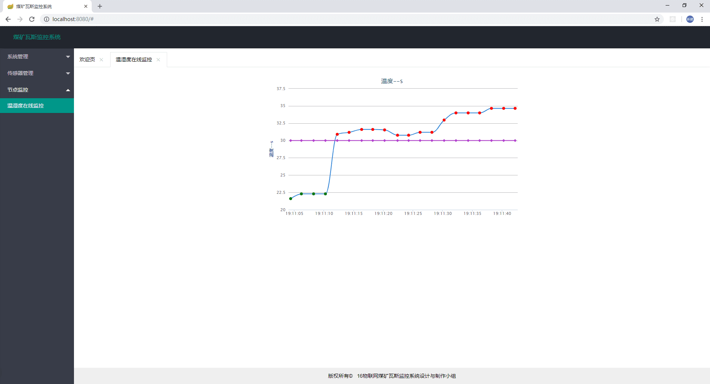

## wsn-pro 

这是大二下学期的无线传感网络实训的项目
是基于zigbee网络的实验，实现了zigbee节点通过网关节点发送数据到电脑端。

### 使用到技术

1. 前段
    - jquery
    - layui
    - vue
    
2. 后端
    - spring boot
    - mybatis 
    - mybatis-plus
    - druid
    - swagger
    
##  界面显示    

### 1. 传感器节点

    

### 2. 网关节点 

### 3. 主界面

### 4. 菜单管理

### 5. 在线接口文档

### 6. 在线串口工具

### 7. 数据记录

### 8. 温度在线监控

